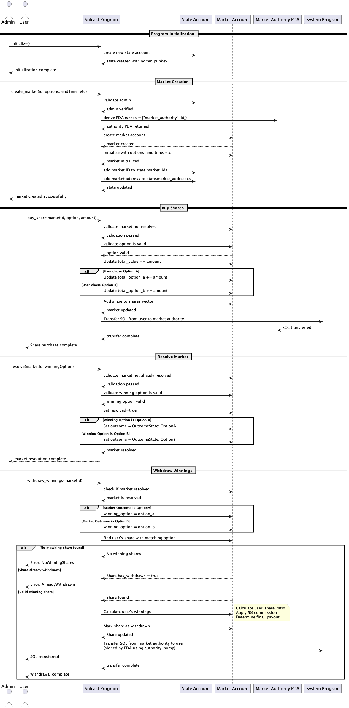

#  Solcast Markets

A decentralized prediction market platform built on Solana blockchain that enables users to create, participate in, and trade on prediction markets.

Link to the website: https://prediction-market-sol.vercel.app/


## Table of Contents

- [Features](#features)
- [Getting Started](#getting-started)
- [Smart Contract](#smart-contract)
- [Project Structure](#project-structure)
- [Market Operations](#market-operations)
- [Technical Details](#technical-details)
- [License](#license)

## Features

- Create and participate in prediction markets
- Buy shares in market outcomes
- View market statistics and trends
- Withdraw winnings when markets are resolved
- Secure fund management through Program Derived Addresses (PDAs)
- Automated market resolution (not implemented)

## Built with love using

- [Next.js](https://nextjs.org/)
- [Tailwind CSS](https://tailwindcss.com/)
- [Anchor](https://anchor-lang.com/)
- [Solana](https://solana.com/)
- [Vercel](https://vercel.com/)

### Prerequisites

- Node.js (v16 or higher)
- npm or yarn
- Solana CLI tools
- A Solana wallet (like Phantom)

### Installation

1. Clone the repository:

```bash
git clone https://github.com/yourusername/prediction-market-pbs-sol.git
cd prediction-market-pbs-sol
```

2. Install dependencies:

```bash
npm install
# or
yarn install
```

3. Start the development server:

```bash
npm run dev
# or
yarn dev
```

4. Open [http://localhost:3000](http://localhost:3000) in your browser.

## Smart Contract

The smart contract is located in the `contracts/market` directory and is built using the Anchor framework.

### Deploying the Contract

1. Navigate to the contract directory:

```bash
cd contracts/market
```

2. Build the contract:

```bash
anchor build
```

3. Deploy the contract:

```bash
anchor deploy --provider.cluster devnet
```

### Contract Details

- **Program ID**: 7QDrqqkxpti8WN4amvMHmcmZtonYeAzYrmdXefvEx3xJ
- **Deployment Command**:

```bash
ANCHOR_PROVIDER_URL=https://api.devnet.solana.com ANCHOR_WALLET=~/.config/solana/id.json yarn deploy
```

## Project Structure

```
├── src/                    # Frontend application code
│   ├── app/               # Next.js app router pages
│   ├── components/        # React components
│   └── idl/              # Solana program IDL
└── contracts/             # Solana smart contract code
    └── market/           # Prediction market program
```

## Market Operations

### Creating a Market

Use the following command to create a new market:

```bash
npm run create-market <marketId> <optionA> <optionB> <endTime> <title> <description>
```

Parameters:

- `marketId`: Unique identifier for the market (no spaces, use hyphens)
- `optionA`: Text for the "Yes" option
- `optionB`: Text for the "No" option
- `endTime`: When the market will end (UNIX timestamp or date string like "2025-12-31")
- `title`: Title of the market
- `description`: Detailed description of the market conditions

Example:

```bash
npm run create-market btc-100k-2025 "Yes" "No" "2025-12-31" "Will BTC exceed $100K in 2025?" "This market resolves to YES if the price of Bitcoin exceeds $100,000 USD at any point during 2025 according to Coinbase."
```

### Closing a Market

To close a market and resolve it:

```bash
ts-node scripts/close-market.ts <market-id> <outcome>
```

## Technical Details

### Token System

The platform uses SPL tokens for market operations:

1. **Token Creation**:

   - Two SPL tokens are created per market (YES and NO options)
   - Token mint authority is a PDA (Program Derived Addresses) controlled by the Solcast program
   - Only the program can mint new tokens

2. **Market Authority**:
   - Acts as a secure escrow account for market funds
   - Verifies market ownership and legitimacy
   - Manages withdrawal mechanisms
   - Deterministically derived from market ID
   - Ensures secure and trustless fund management

### Market Creation Example

```bash
anchor call create_market \
 --args '{"id":"market1", "options":["Yes", "No"], "end_time":"1714983467", "buy_token":"4zMMC9srt5Ri5X14GAgXhaHii3GnPAEERYPJgZJDncDU", "banner_url":"https://example.com/banner.jpg", "description":"Will BTC hit 100k in 2025?", "title":"BTC 100k", "end_time_string":"Dec 31, 2025", "start_time_string":"Jan 1, 2025", "resolution_source":"CoinGecko"}' \
 --program-id 7xMuyXtTipSYeTWb4esdnXyVrs63FeDp7RaEjRzvYUQS
```

## System Sequence Diagrams

### Present

The present sequence diagram shows the flow developed during the hackathon.



### Future

This is the sequence diagram of the future, improved flow. Ideally users should reveive actual shares in the form of Tokens (SPL). This is more aligned with the real world, where users can trade shares on other platforms before the market is resolved.


## Responsivness

The website is responsive and works on all devices.


## License

This project is licensed under the MIT License - see the LICENSE file for details.
